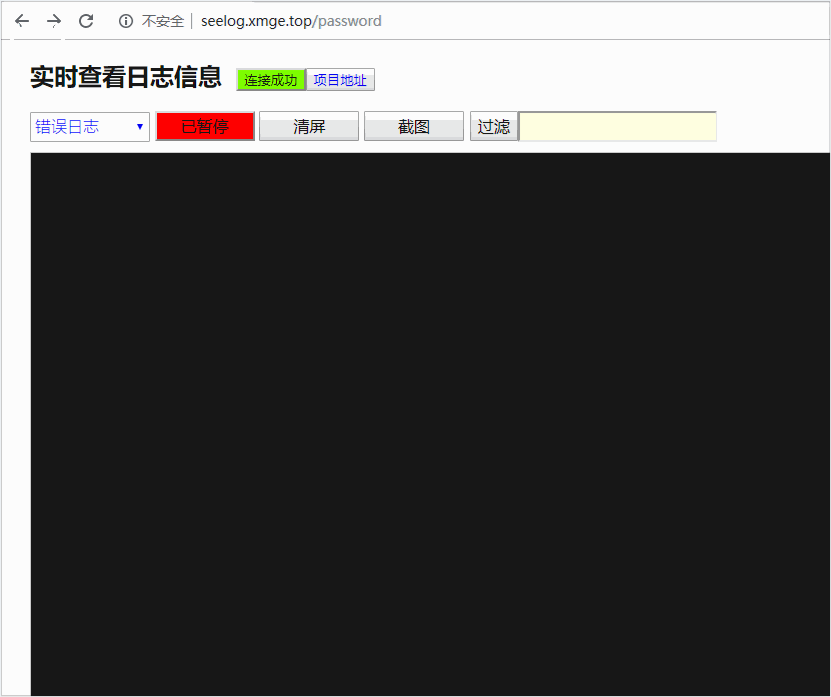

# hootail
[](https://github.com/yunnet/hootail/blob/master/LICENSE)

Forked from `github.com/xmge/seelog`

### 项目介绍
* 与 golang 项目集成、提供浏览器实时查看日志的功能，类似 `tail -f xxx.log`
* 支持监控多个日志文件
* 支持多浏览器同时访问
* 支持浏览器 websocket 断线重连
* 支持暂停、清屏、过滤功能
* 查找功能可直接使用浏览器 `Ctrl+F` 来完成

### 集成方式

```go
import "github.com/yunnet/hootail"

hootail.Tail("错误日志", "err.log")   // 实时监听 err.log
hootail.Tail("调试日志", "debug.log") // 实时监听 debug.log
hootail.Serve(27129)
```

在浏览器中访问 `http://host:port/hootail`

### 项目展示


